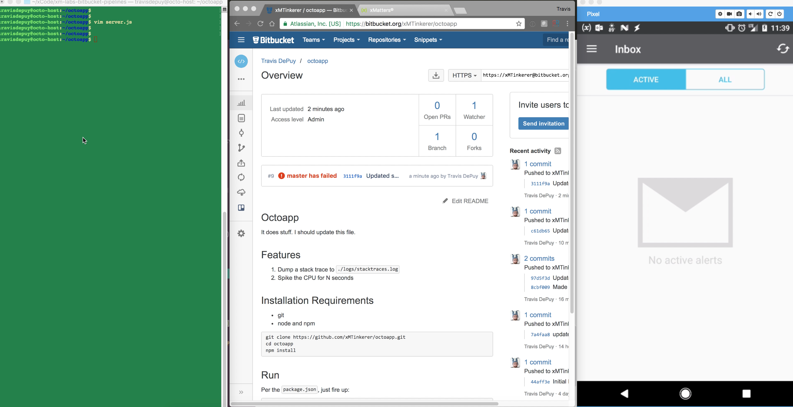
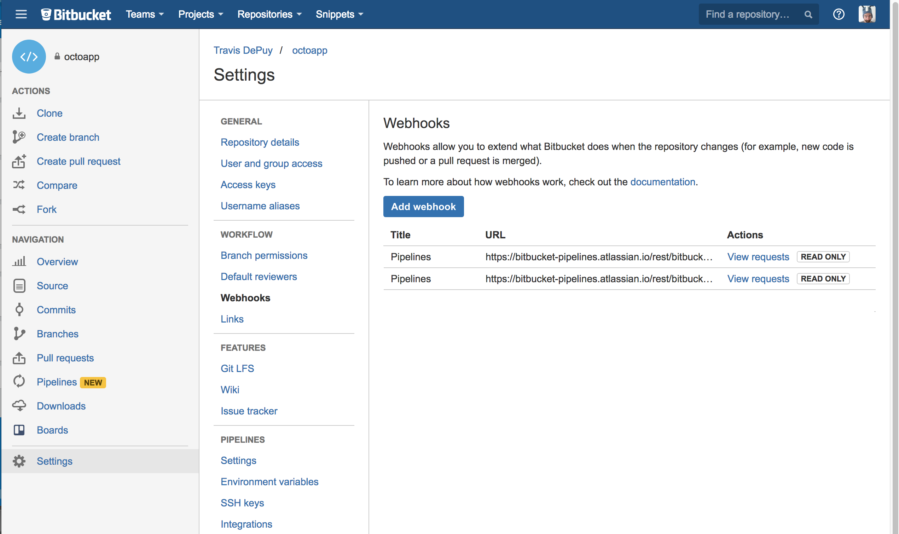
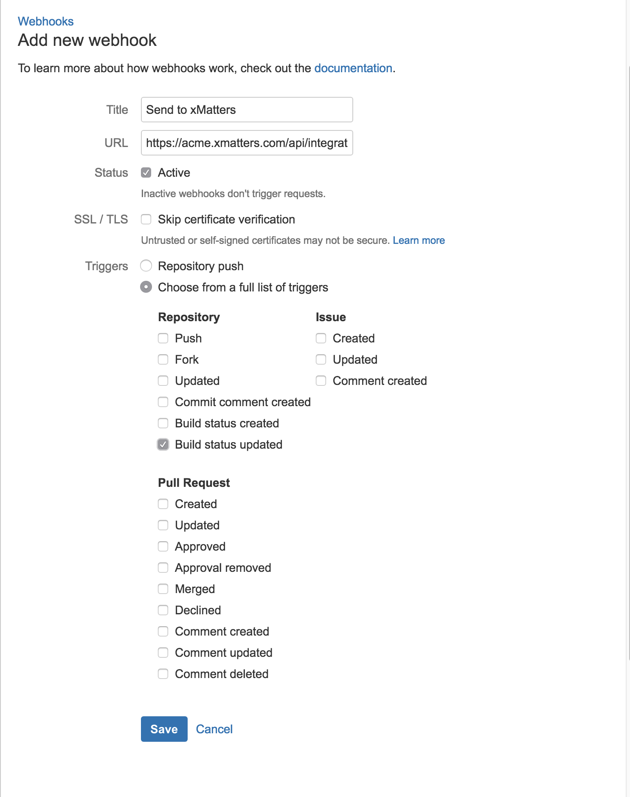
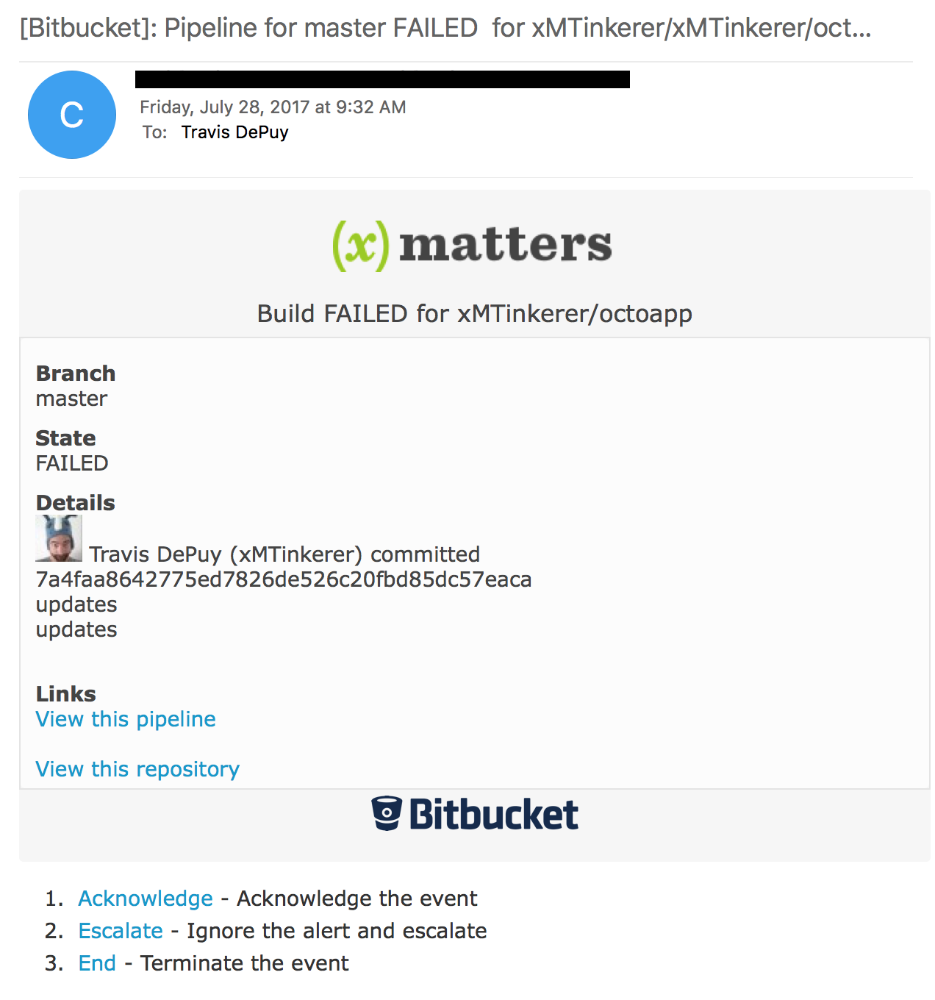
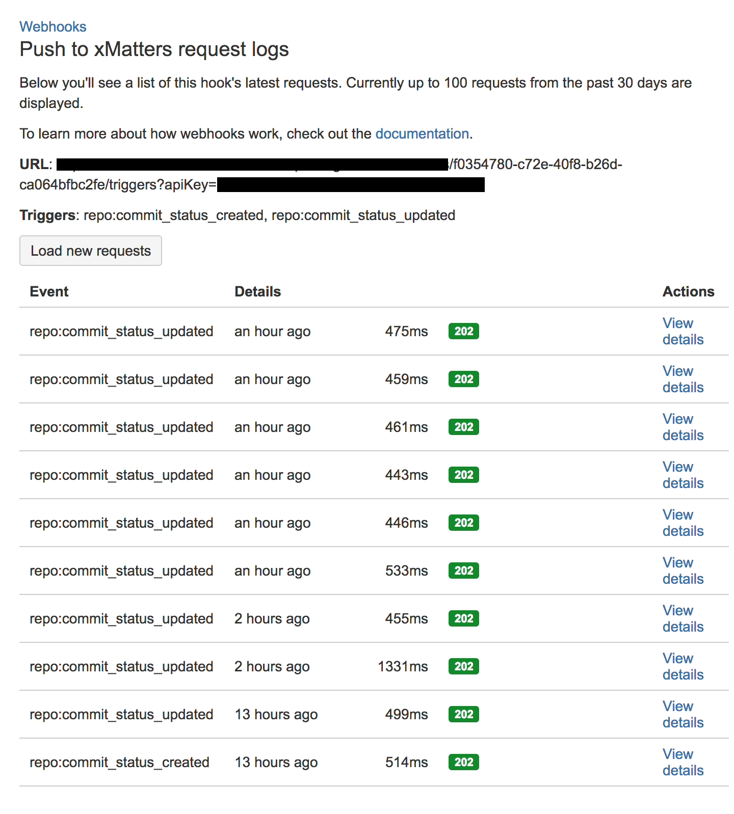

# Bitbucket Pipelines
Build, test and deploy, and with this integration, alert, from Bitbucket. This integration adds xMatters messaging to the build failed notifications from the pipeline. 

Check out the video:
[](media/Pipelines.mov "Pipelines video")

# Pre-Requisites
* Bitbucket account - [Get one](https://bitbucket.org/)! 
* xMatters account - If you don't have one, [get one](https://www.xmatters.com)!

# Files
* [BitbucketPipeline.zip](BitbucketPipeline.zip) - The comm plan with integration builder scripts and message templates.

# How it works
After the build status changes, a webhook is fired to the xMatters integration builder. The script in the IB inspects the build type and status and if it is a failed build, a new event is created targeting the default recipients in the form. 

# Installation

## xMatters set up
1. Login to the xMatters account and navigate to the Developer tab. 
2. Import the [BitbucketPipeline.zip](BitbucketPipeline.zip) comm plan. 
3. Click Edit > Integration Builder next to the Bitbucket Pipeline comm plan.
4. Expand the inbound integrations and click the link for `Inbound from Bitbucket Pipeline`. Scroll down and copy the url at the bottom. Save for later. 
5. Click the Form tab and Edit > Layout. Enter the targeted recipients in the recipients box. Alternatively, subscription panels can be added to let users subscribe to notifications. See [here](https://help.xmatters.com/OnDemand/xmodwelcome/communicationplanbuilder/subscriptionforms.htm?cshid=SubscriptionFormListPlace) for details. 


## Bitbucket Pipeline set up
1. Login to Bitbucket and navigate to the desired repo. 
2. Click Settings > Webhooks:

<kbd>
	
</kbd>

3. Click Add Webhook and enter a title and paste in the url from the inbound integration. Check `Build status updated`. Other boxes can be checked, but keep in mind this integration was built with the intent of notifying on failed builds, so the integration script will need to be updated to reflect other options. 

<kbd>
	
</kbd>

4. Click Save.
5. Repeat for each repo. 

# Testing
Commit a change to the repo that will fail the build. For example, for a node.js application, having this entry in `package.json` will fail the test:

```json
/// snip  ///
  "scripts": {
    "test": "echo \"Error: no test specified\" && exit 1",
    "start": "nodemon -e css,ejs,js,json --watch ."
  },
/// snip  ///
```

Once the build fails, a notification will be sent to the recipients saved in the form layout (unless subscriptions were set up).

<kbd>
	
</kbd>


# Troubleshooting
In the repo Settings > Webhooks section, each webhook has a `View Requests` button. This shows the details of the HTTP request from pipelines out to xMatters. Review this list for any errors:

<kbd>
	
</kbd>

Then if evrything looks ok there, check the Activity Stream in the `Inbound from Bitbucket Pipeline` inbound integration for any errors. 


